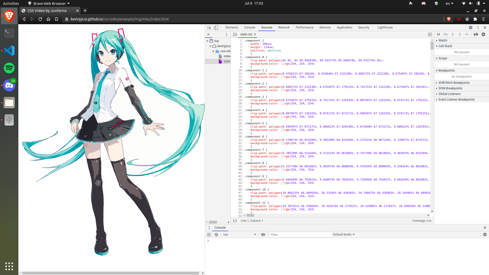

# CSS Art & Video Generator

Converts images and video frames to pure CSS + HTML files using Breadth-first Search and Canny Edge Detection with keyframe animations.



## See It Live*
https://kevinjycui.github.io/css-video/

**Image examples only (see video examples by cloning the repository)*

## Tested on
 * [ Google Chrome](https://www.google.com/chrome/index.html)
 * [ Microsoft Edge](https://microsoftedgewelcome.microsoft.com/en-us)
 * [ Mozilla Firefox](https://www.mozilla.org/en-US/firefox/new/)
 * [ Brave](https://brave.com/)

## Tutorial
#### Install dependencies
```sh
$ apt update
$ apt install git python3-dev python3-pip ffmpeg
```

#### Clone repository
```sh
$ git clone https://github.com/kevinjycui/css-video.git
$ cd css-video
```

#### Install requirements
```sh
$ python -m venv env
$ . env/bin/activate
(env) $ pip install -r requirements.txt
```

#### Add an image file (PNG or JPG) or convert a video file into frames using FFmpeg (note frames should be named `frame%d.png` in which `%d` represents an index starting from 0)

Example: Converting a video named `input.mp4` into frames into a directory named `frames` (with 20 FPS)
```sh
(env) $ mkdir frames
(env) $ ffmpeg -i input.mp4 -vf fps=20 frames/frame%d.png
```

#### Run the converter

Image
```sh
(env) $ python3 generator.py -i input.png
```
Video
```sh
(env) $ python3 generator.py -f frames/
```

## References
 * [YouTube: The Art of Pure CSS](https://youtu.be/wUQbchYY80U)
 * [YouTube: Bad Apple!! played with pure CSS in high quality](https://youtu.be/MQbjW2VfaHs)
